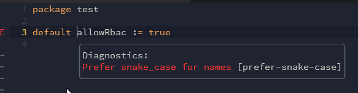

# Editor support

## Neovim via none-ls

[none-ls](https://github.com/nvimtools/none-ls.nvim) - Use Neovim as a language server to inject LSP diagnostics, code actions, and more via Lua.

Minimal installation via [VimPlug](https://github.com/junegunn/vim-plug)

```vim
Plug 'nvim-lua/plenary.nvim'
Plug 'nvimtools/none-ls.nvim'

lua <<EOF
local null_ls = require("null-ls")
null_ls.setup {
    sources = { null_ls.builtins.diagnostics.regal }
}
EOF
```

Using sample rego file `test.rego` with following content

```rego
package test

default allowRbac := true
```

diagnostics may look like this.


