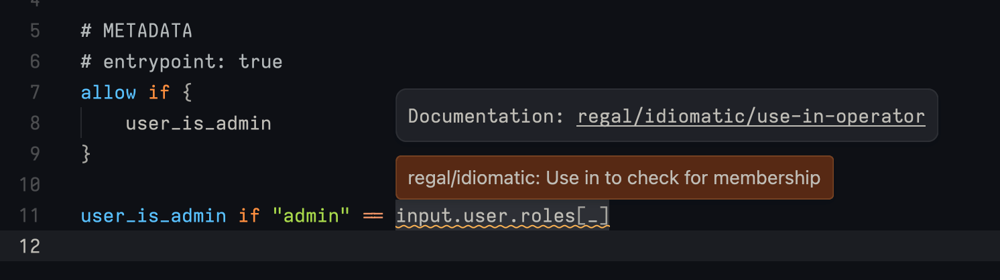
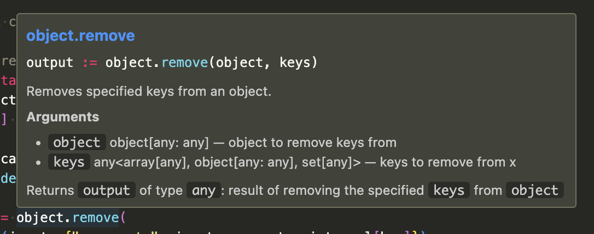
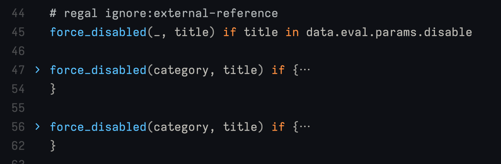
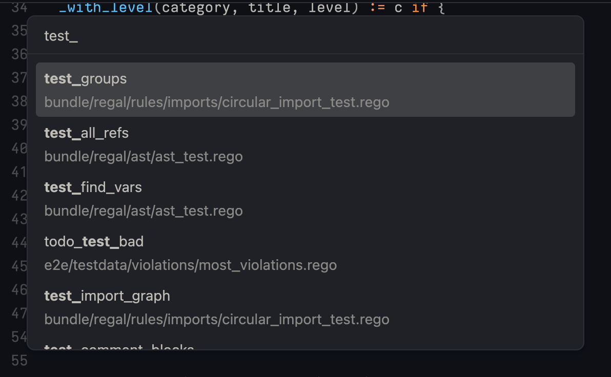
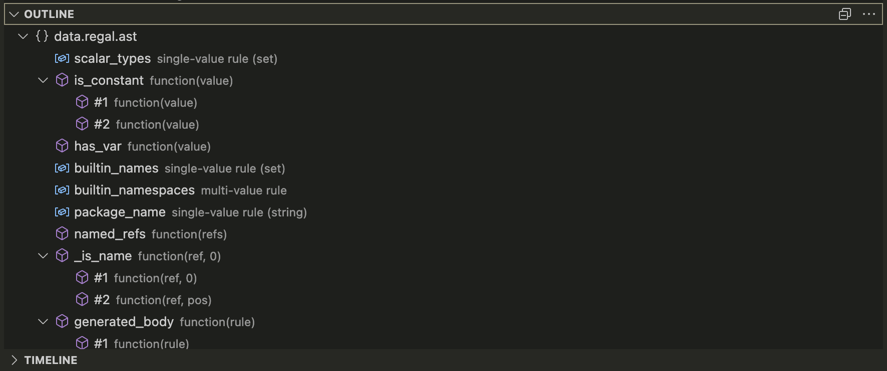
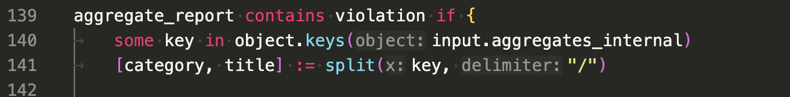
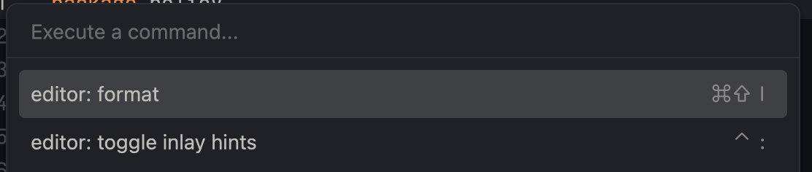
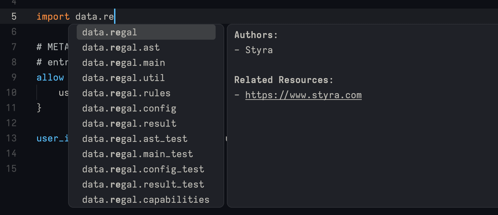
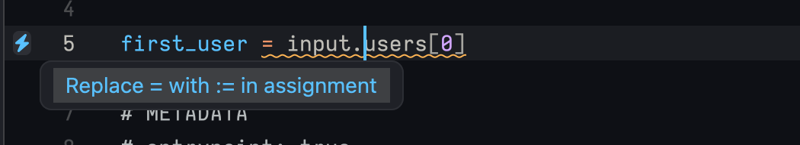

# Language Server

In order to support Rego policy development in editors like
[VS Code](https://github.com/open-policy-agent/vscode-opa) or [Zed](https://github.com/StyraInc/zed-rego),
Regal provides an implementation of the
[Language Server Protocol](https://microsoft.github.io/language-server-protocol/) (LSP) for Rego.

This implementation allows the result of linting to be presented directly in your editor as you work on your policies,
and without having to call Regal from the command line. The language server however provides much more than just
linting!

## Features

The Regal language server currently supports the following LSP features:

### Diagnostics

Diagnostics are errors, warnings, and information messages that are shown in the editor as you type. Regal currently
uses diagnostics to present users with either parsing errors in case of syntax issues, and linter violations reported
by the Regal linter.

Future versions of Regal may include also [compilation errors](https://github.com/StyraInc/regal/issues/745) as part of
diagnistics messages.

### Hover

The hover feature means that moving the mouse over certain parts of the code will bring up a tooltip with documentation
for the code under the cursor. This is particularly useful for built-in functions, as it allows you to quickly look up
the meaning of the function, and the arguments it expects.

The Regal language server currently supports hover for all built-in functions OPA provides.

### Go to definition

Go to definition allows references to rules and functions to be clicked on (while holding `ctrl/cmd`), and the editor
will navigate to the definition of the rule or function.

### Folding ranges

Regal provides folding ranges for any policy being edited. Folding ranges are areas of the code that can be collapsed
or expanded, which may be useful for hiding content that is not relevant to the current task.

Regal supports folding ranges for blocks, imports and comments.

### Document and workspace symbols

Document and workspace symbols allow policy authors to quickly scan and navigate to symbols (like rules and functions)
anywhere in the document or workspace.

VS Code additionally provides an "Outline" view, which is a nice visual representation of the symbols in the document.

### Inlay hints

Inlay hints help developers quickly understand the meaning of the arguments passed passed to functions in the code,
by showing the name of the argument next to the value. Inlay hints can additionally be hovered for more information,
like the expected type of the argument.

Regal currently supports inlay hints for all built-in functions. Future versions may support inlay hints for
user-defined functions too.

### Formatting

Regal uses the `opa fmt` formatter for formatting Rego. This is made available as a command in editors, but also via
a [code action](#code-actions) when unformatted files are encountered.

### Code completions

Code completions, or suggestions, is likely one of the most useful features of the Regal language server. And best of
all, you don't need to do anything special for it to happen! Just write your policy as you normally would, and Regal
will provide suggestions for anything that could be relevant in the context that you're typing. This could for example
be suggestions for:

- Built-in functions
- Local variables
- Imported packages
- References from anywhere in the workspace
- And much more!

New completion providers are added continuosly, so if you have a suggestion for a new completion, please
[open an issue](https://github.com/StyraInc/regal/issues)!

### Code actions

Code actions are actions that appear in the editor when certain conditions are met. One example would be "quick fixes"
that may appear when a linter rule has been violated. Code actions can be triggered by clicking on the lightbulb icon
that appears on the line with a diagnostic message, or by pressing `ctrl/cmd + .` when the cursor is on the line.

Regal currently provides quick fix code actions for the following linter rules:

- [opa-fmt](https://docs.styra.com/regal/rules/style/opa-fmt)
- [use-rego-v1](https://docs.styra.com/regal/rules/imports/use-rego-v1)
- [use-assignment-operator](https://docs.styra.com/regal/rules/style/use-assignment-operator)
- [no-whitespace-comment](https://docs.styra.com/regal/rules/style/no-whitespace-comment)

## Unsupported features

See the
[open issues](https://github.com/StyraInc/regal/issues?q=is%3Aissue+is%3Aopen+label%3A%22language+server+protocol%22)
with the `language server protocol` label for a list of features that are not yet supported by the Regal language
server, but that are planned for the future. If you have suggestions for anything else, please create a new issue!

Also note that not all clients (i.e. editors) may support all features of a language server! See the
[editor support](/docs/editor-support.md) page for information about Regal support in different editors.

## Community

If you'd like to discuss the Regal's language server, or just talk about Regal in general, please join us in the
`#regal` channel in the Styra Community [Slack](https://communityinviter.com/apps/styracommunity/signup)!
